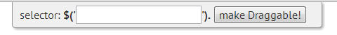

Drag and drop elements bookmarklet
=====================

A javascript bookmarklet for enabling drag and drop functionality of elements in any page, using jQuery and jQuery UI's Draggable widget.

This bookmarklet will open an input field where you can type a selector for the elements you want to have drag and drop behavior. 

The plugin will absolute position the selected elements on the page.

You can get the bookmarklet at [http://code.medula.cl/article_Drag-and-drop-element-bookmarklet.html](http://code.medula.cl/article_Drag-and-drop-element-bookmarklet.html) or in the `gh-pages` branch [http://baamenabar.github.io/draggable-bookmarklet/](http://baamenabar.github.io/draggable-bookmarklet/) where you can also play some with it.